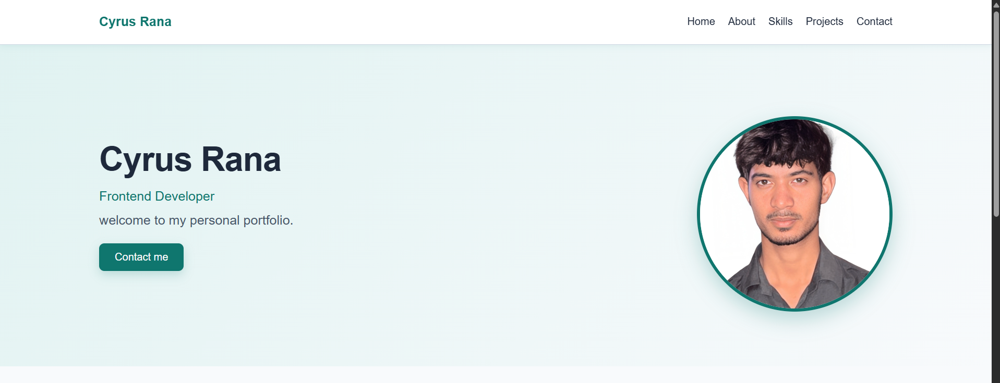
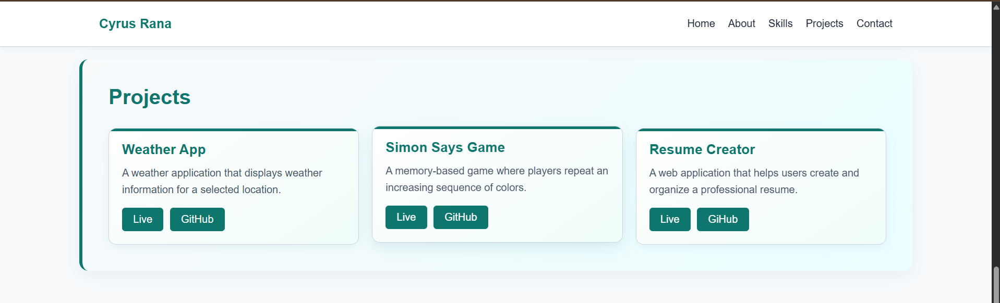
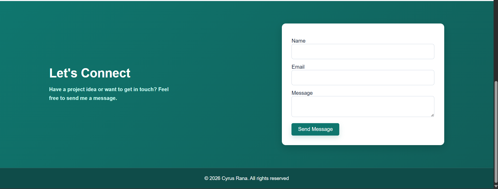

# Cyrus Portfolio

A personal portfolio website showcasing my skills, projects, and contact information.

## Features

- Responsive portfolio design
- Sticky navigation bar
- About Me section
- Skills section
- Project cards
- Contact form
- Responsive design for mobile devices
- Smooth scrolling navigation

## Technologies Used

- HTML
- CSS

## Screenshots

### Home

### Projects

### Contact

## How to Run

1. Clone the repository.
2. Open the project folder.
3. Open `index.html` in a web browser.

## Live Demo

Not deployed yet..

## GitHub Repository

https://github.com/CyrusRana/Cyrus_Portfolio

## Creativity

Added a sticky navigation bar that remains visible while scrolling through the portfolio.